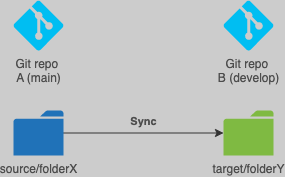

# Gitsync - A GIT syncronizer between two unrelated git repositories

## Use case



You work in different projects and you will not able make references during CI/CD or would you want to share code among unrelated project. The **Gitsync** will help you making two diferrent repositories in sync.

## Implementation

### Configuration example

In yours ```.gitsync``` folder create a file **.yml** (or as many as needed) configuring gitsync.

```yaml
gitsync:
  strategy: create-branch
  workdir: ~/Development/Workspaces/ioops/gitsync-test #Default: ~/gitsync if not provided.
  source:
    repository: source
    path: pipelines # Relative to repository's root
    branch: main
  target:
    repository: target
    path: pipelines # Relative to repository's root
    branch: main
  sync:
    mirror: true
```

Check [sample gitsync](.gitsync_sample) files for configuration scenarios.

### Install gitsync

Create a ```.gitsync``` folder in your repository root's and install gitsync.

```bash
cd your-git-repo
mkdir .gitsync
curl https://raw.githubusercontent.com/ioops-io/gitsync/main/gitsync.py -o .gitsync/gitsync.py
```

### Run gitsync

```bash
cd your-git-repo
python3 .gitsync/gitsync.py -f .gitsync/gitsync.yml
```

You can run manually or thru your CI/CD pipelines as regular shell script.
